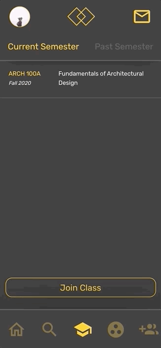

<div align='center'>

</div>
<h1 align="center">Pare</h1>
<h2 align="center">Find your <a href="https://pare-afb7e.web.app/">Pare</a>!</h2>

<div align='center'>
<h3 align="center">Learn about campus events!</h3>


<h3 align="center">Keep track of your classes and coursework!</h3>


<h3 align="center">Form Study Groups to connect and engage with classmates!</h3>


<h3 align="center">Need some extra help? Find a Pare!</h3>

</div>

## Setup

### Clone Directory

```
cd [project directory]
git clone https://github.com/kevinreber/pare.git
```

### Download dependencies

```
cd pare
npm install
```

### Start Server

```
npm start
```

Open [http://localhost:3000](http://localhost:3000) to view project in the browser.<br/>
May see warnings if not using placeholder data.

---

## Run Tests

```
npm test
```

Launches the test runner in the interactive watch mode.<br />
See the section about [running tests](https://facebook.github.io/create-react-app/docs/running-tests) for more information.

---

## Built With

- [React JS](https://github.com/facebook/create-react-app)
- [React Redux](https://react-redux.js.org/)
- [Material UI](https://material-ui.com/)
- [Google Firebase](https://firebase.google.com/)
- [Google Maps API](https://developers.google.com/maps/documentation)
- [Google Cloud Platform](https://cloud.google.com/)

---

## Berkeleytime API

- [Berkeleytime](https://www.berkeleytime.com/apidocs)

---

## Authors

- Kevin Reber - [Github](https://github.com/kevinreber) - [Website](https://www.kevinreber.dev/) - [LinkedIn](https://www.linkedin.com/in/kevin-reber/)

## Hosted On

[Firebase](https://firebase.google.com/)
